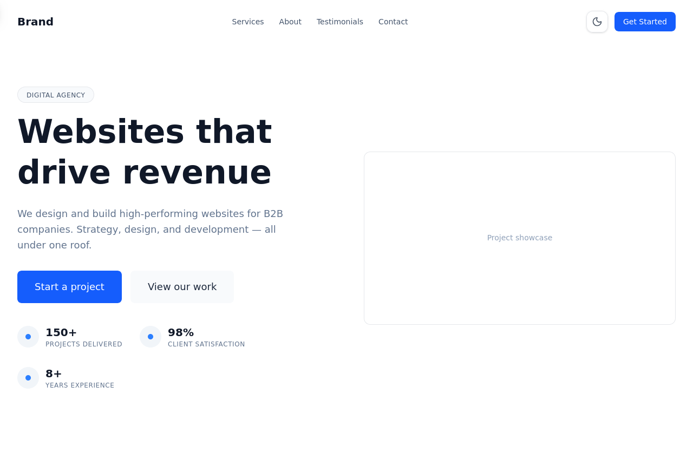
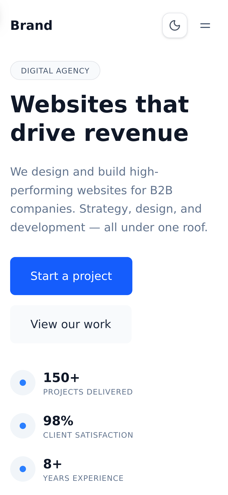
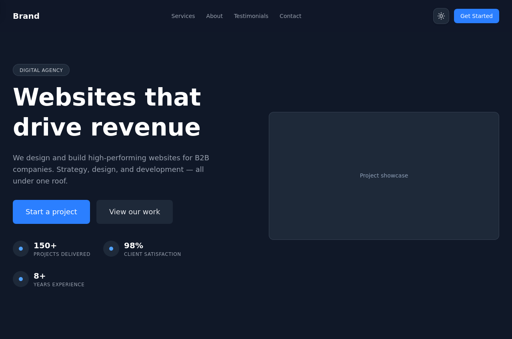

# Business Template

A professional single-page business website built with React, Vite, and Tailwind CSS. Designed for B2B companies, agencies, and service-based businesses.

## Live Demo
[https://business-template-kohl.vercel.app/](https://business-template-kohl.vercel.app/)

## Screenshots

| Desktop | Mobile | Dark Mode |
|---------|--------|-----------|
|  |  |  |


## Purpose

This project demonstrates:

- **Reusable React architecture** — Component-based structure with UI primitives (Button, Card, Section) that accept props and compose into page sections
- **Responsive design** — Mobile-first layout using Tailwind breakpoints, tested across mobile, tablet, and desktop
- **Accessibility** — Skip-to-content link, ARIA attributes, keyboard navigation, focus-visible states, semantic HTML, and `prefers-reduced-motion` support
- **SEO setup** — Open Graph metadata, Twitter cards, robots.txt, sitemap.xml, and a centralized SEO config file
- **Performance optimization** — Memoized context values, tree-shaken imports, lazy font loading, and efficient scroll listeners

## Features

- **Responsive** — Mobile-first design across all breakpoints
- **Dark mode** — Class-based toggle with localStorage persistence and system preference detection
- **Animated sections** — Scroll-triggered fade-in animations via Motion, respecting `prefers-reduced-motion`
- **SEO** — Open Graph tags, Twitter cards, robots.txt, sitemap.xml, and centralized SEO config
- **Accessibility** — Skip-to-content link, ARIA attributes, keyboard navigation, focus-visible states, semantic HTML
- **Reusable components** — Modular UI components (Button, Card, Section, etc.) that accept props for easy customization

## Tech Stack

| Tool | Purpose |
|------|---------|
| [React 19](https://react.dev) | UI library |
| [Vite 8](https://vite.dev) | Build tool and dev server |
| [Tailwind CSS 4](https://tailwindcss.com) | Utility-first CSS |
| [Motion](https://motion.dev) | Scroll and layout animations |
| [Lucide React](https://lucide.dev) | Icon library |

## Project Structure

```
src/
├── components/
│   ├── layout/          # Navbar, Footer
│   ├── sections/        # Hero, Services, About, Testimonials, Contact
│   └── ui/              # Button, Card, Container, Section, SectionTitle,
│                        # FadeIn, BrowserMockup, TeamMockup, HeroStats,
│                        # ThemeProvider, ThemeToggle
├── data/                # Content and configuration (one file per section)
├── hooks/               # useActiveSection, useScrolled
├── assets/              # Images, icons, logos (add your own)
├── App.jsx              # Main page layout
├── main.jsx             # Entry point
└── index.css            # Tailwind imports and dark mode variant
```

## Installation

```bash
# Clone the repository
git clone https://github.com/your-username/business-template.git
cd business-template

# Install dependencies
npm install

# Start the development server
npm run dev
```

Open [http://localhost:5173](http://localhost:5173) in your browser.

### Available Scripts

| Command | Description |
|---------|-------------|
| `npm run dev` | Start development server |
| `npm run build` | Build for production |
| `npm run preview` | Preview the production build locally |
| `npm run lint` | Run ESLint |

## Customization

### Company data

Edit the files in `src/data/` to update content across the site:

```js
// src/data/company.js
export const company = {
  brand: "Your Brand",
  description: "Your tagline here.",
};
```

Each section has its own data file (`hero.js`, `services.js`, `about.js`, etc.) with exported defaults.

### SEO metadata

Update `src/data/seo.js` for centralized SEO configuration. For production, also update the corresponding `<meta>` tags in `index.html`.

### Adding sections

1. Create a new component in `src/components/sections/`
2. Export it from `src/components/sections/index.js`
3. Import and render it in `src/App.jsx`

### Theme colors

Edit the Tailwind config or update the color classes directly in components. The design system uses:

- **Accent**: `blue-600` (`#2563EB`)
- **Background**: `white` / `gray-900` (dark)
- **Text**: `gray-900` / `slate-500` (muted)

## Deployment

### Vercel

```bash
npm i -g vercel
vercel
```

### Netlify

Push to a Git repository, connect it in the Netlify dashboard, and set:

- **Build command**: `npm run build`
- **Publish directory**: `dist`

### Static hosting

```bash
npm run build
```

Upload the `dist/` directory to any static host (GitHub Pages, Cloudflare Pages, S3, etc.).

## License

MIT

Copyright (c) 2026 Spekter
